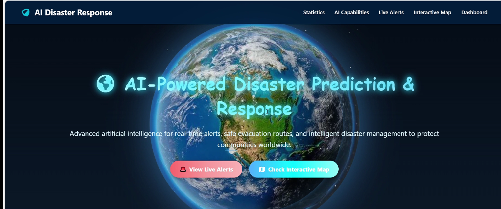
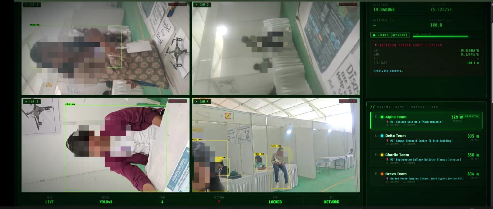
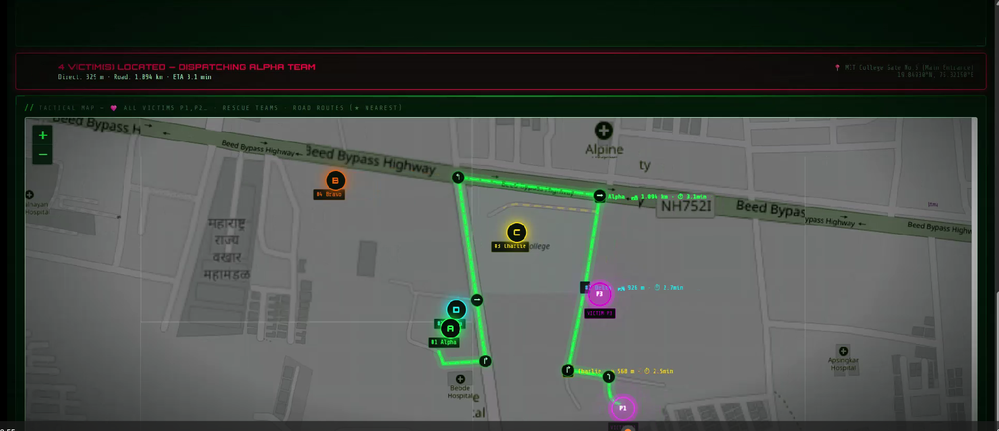
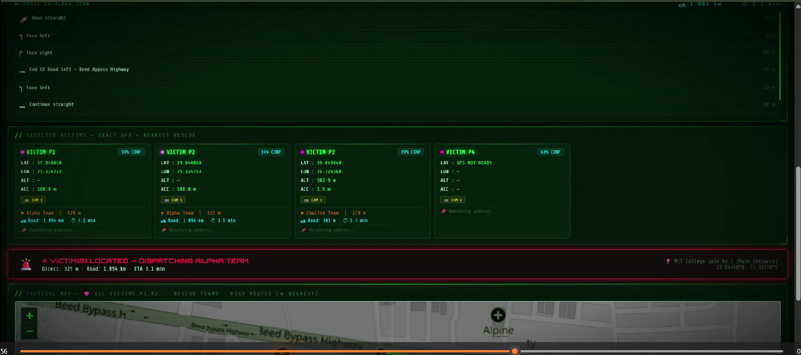
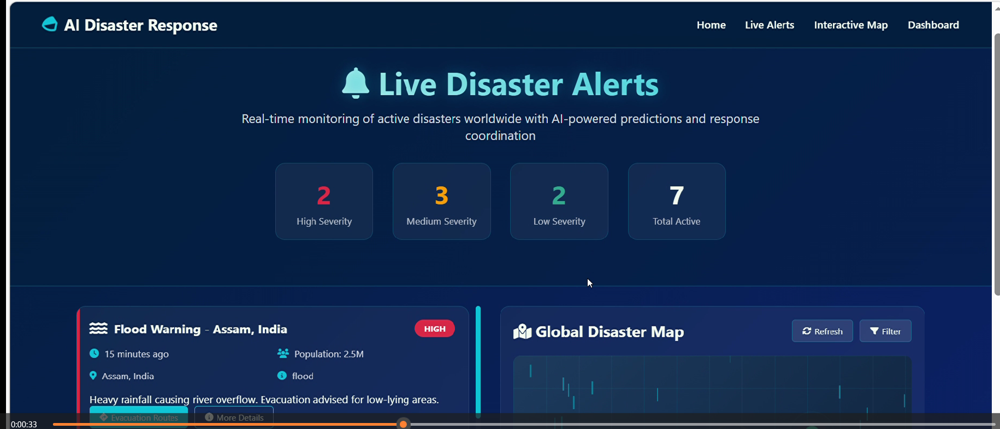
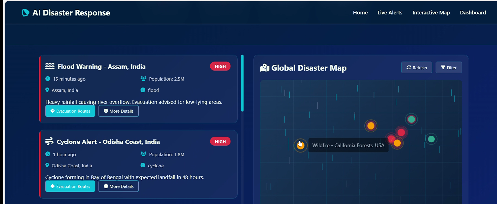
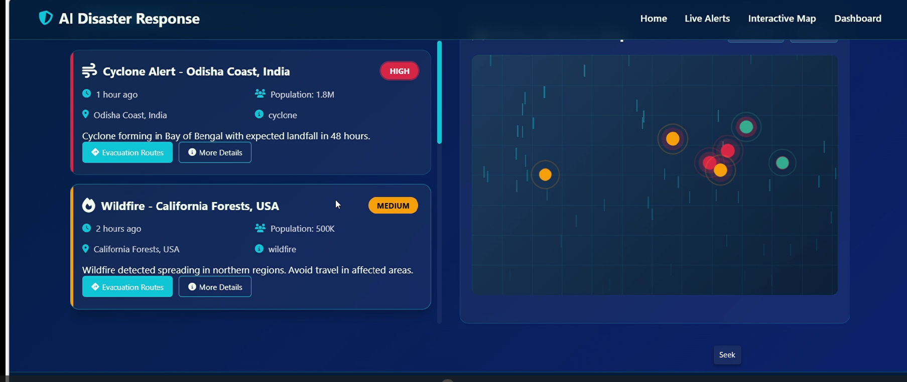
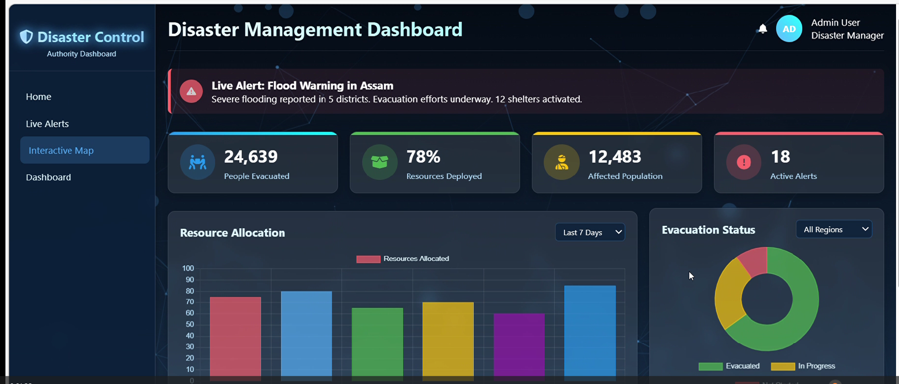
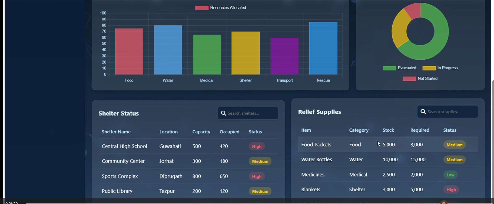
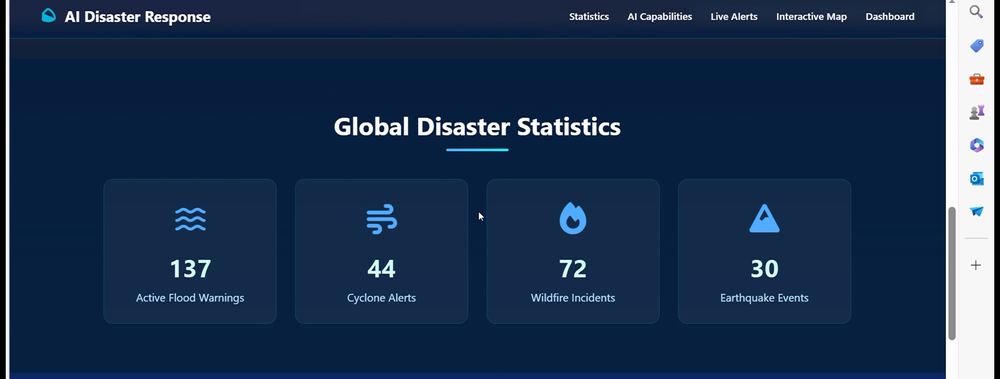

# 🚨 AI-Based Multi-Disaster Prediction & Rescue System

An AI-powered disaster management and emergency rescue system designed to support **disaster prediction, real-time victim detection, location tracking, and shortest rescue path planning**.

The system combines **Machine Learning, Computer Vision, Drone Surveillance, GPS, Geospatial Mapping, and Smart Routing** to assist rescue teams during disasters such as **Floods, Wildfires, Cyclones, and Earthquakes**.

---

## 📌 Project Overview

During natural disasters, rescue teams face major challenges such as:

- Identifying victims in affected areas
- Locating victims accurately
- Finding the nearest rescue team
- Selecting safe and shortest routes
- Avoiding flooded, damaged, or blocked roads
- Predicting disaster risk and generating early warnings
- Monitoring affected areas in real time

This project provides an integrated solution where **drone cameras capture live aerial footage**, the footage is transmitted to the system/laptop, and AI-based computer vision detects victims.

Once a victim is detected, the system determines the victim's location and calculates an **optimal rescue route from the nearest rescue team**, while avoiding blocked or dangerous zones.

The system also includes ML-based disaster prediction modules for **flood, wildfire, cyclone, and earthquake risk assessment**.

---

# 🎯 Objectives

- Detect victims in disaster-affected areas using **drone camera footage**
- Track victim locations using **GPS and geographical coordinates**
- Identify the **nearest rescue team**
- Calculate the **shortest/optimal rescue path**
- Avoid blocked areas such as floods, fire, rubble, and building collapse zones
- Predict disaster risks using **Machine Learning**
- Generate risk levels and disaster alerts
- Provide a centralized dashboard for rescue operations

---

# 🏗️ System Architecture

```text
                 ┌─────────────────────────┐
                 │   Disaster Data Sources │
                 │ Flood / Fire / Cyclone  │
                 │      / Earthquake       │
                 └────────────┬────────────┘
                              │
                              ▼
                 ┌─────────────────────────┐
                 │   Data Preprocessing    │
                 │ Feature Engineering     │
                 │ Data Cleaning            │
                 └────────────┬────────────┘
                              │
                              ▼
                 ┌─────────────────────────┐
                 │    ML Prediction        │
                 │ XGBoost / LightGBM      │
                 └────────────┬────────────┘
                              │
                              ▼
                 ┌─────────────────────────┐
                 │ Risk Score & Alerts     │
                 │ Low / Moderate / High   │
                 │ / Critical              │
                 └─────────────────────────┘


                    DRONE RESCUE SYSTEM

Drone Camera
     │
     │ Live Video
     ▼
┌───────────────────┐
│ Laptop / Server   │
│ Video Processing  │
└─────────┬─────────┘
          │
          ▼
┌───────────────────┐
│ YOLOv8 + OpenCV   │
│ Victim Detection  │
└─────────┬─────────┘
          │
          ▼
┌───────────────────┐
│ Victim Location   │
│ GPS Coordinates   │
└─────────┬─────────┘
          │
          ▼
┌────────────────────────────┐
│ Nearest Rescue Team        │
│ + Distance Calculation     │
└────────────┬───────────────┘
             │
             ▼
┌────────────────────────────┐
│ Smart Route Planning       │
│ OSRM + OpenStreetMap       │
│ + Haversine Distance       │
└────────────┬───────────────┘
             │
             ▼
┌────────────────────────────┐
│ Safe & Shortest Rescue     │
│ Route to Victim             │
└────────────────────────────┘
```

---

# 🔄 System Workflow

```text
Drone Camera
      │
      ▼
Live Aerial Video
      │
      ▼
Video Processing using OpenCV
      │
      ▼
YOLOv8 Victim Detection
      │
      ▼
Victim Identified
      │
      ▼
GPS / Geographical Location
      │
      ▼
Find Nearest Rescue Team
      │
      ▼
Calculate Distance
      │
      ▼
OSRM + OpenStreetMap
      │
      ▼
Check Road / Route Conditions
      │
      ▼
Optimal Rescue Route
      │
      ▼
Rescue Team Dashboard
```

---

# 🤖 AI & Machine Learning Modules

## 🌊 Flood Prediction

The flood prediction module analyzes relevant environmental and weather parameters to estimate flood risk.

Possible risk levels:

- Low
- Moderate
- High
- Critical

---

## 🔥 Wildfire Prediction

The wildfire prediction module analyzes environmental conditions such as temperature, humidity, wind conditions, and other relevant parameters to estimate wildfire risk.

---

## 🌀 Cyclone Prediction

The cyclone prediction module uses historical and meteorological data to estimate the possibility and risk level of cyclone formation.

---

## 🌎 Earthquake Risk Assessment

The earthquake module analyzes earthquake-related historical and geographical data to support earthquake risk assessment and disaster monitoring.

---

# 👁️ Computer Vision Module

The computer vision module uses **YOLOv8 and OpenCV** to process drone footage.

### Process

```text
Drone Video
     ↓
OpenCV Frame Extraction
     ↓
YOLOv8 Object Detection
     ↓
Person/Victim Detection
     ↓
Bounding Box
     ↓
Confidence Score
     ↓
Victim Information
```

The detected victim information can then be used by the rescue routing module.

---

# 🚁 Drone Surveillance

The drone acts as the aerial surveillance component of the system.

The drone camera captures affected areas from above and provides video footage to the processing system.

### Advantages

- Covers large affected areas
- Provides aerial visibility
- Helps identify victims in inaccessible locations
- Reduces the need for immediate manual inspection
- Supports real-time monitoring

---

# 📍 Victim Location Tracking

After a victim is detected, the system associates the detection with geographical coordinates.

The location information can be represented using:

- Latitude
- Longitude
- GPS coordinates
- Map location

This allows rescue teams to identify where assistance is required.

---

# 🚑 Nearest Rescue Team

The system maintains the geographical locations of available rescue teams.

For every detected victim:

1. Victim coordinates are obtained.
2. Rescue team coordinates are considered.
3. Distance between victim and rescue teams is calculated.
4. The nearest suitable rescue team is selected.
5. The route is generated.

---

# 🗺️ Smart Rescue Route Planning

The routing module uses:

- **OpenStreetMap**
- **OSRM**
- **Haversine Distance**

### Haversine Distance

Haversine distance is used to calculate the approximate geographical distance between two latitude-longitude coordinates.

```text
Rescue Team
     │
     │
     ▼
Calculate Geographical Distance
     │
     ▼
Find Nearest Team
     │
     ▼
OSRM Route Calculation
     │
     ▼
Optimal Rescue Route
     │
     ▼
Victim Location
```

The system can be extended to avoid roads or zones affected by:

- Flooding
- Fire
- Rubble
- Building collapse
- Road blockage
- Other dangerous conditions

---

# 🖥️ System Screenshots

## 1. Landing Page



The landing page provides an overview of the AI-based disaster prediction, victim detection, and rescue path planning system.

---

## 2. Person Detection



The computer vision module uses YOLOv8 to detect people/victims from disaster-affected area footage captured by the drone.

---

## 3. Shortest Rescue Path on Map



After detecting a victim, the system identifies the victim's location and calculates an optimal rescue route using geographical mapping and routing.

---

## 4. Victim Details



The system displays important information about detected victims to support rescue team decision-making.

---

## 5. Live Disaster Alert



The system provides live disaster alerts and displays the current disaster status to support early response.

---

## 6. Live Disaster Alerts



Additional live alert information is presented to help rescue teams monitor ongoing disaster situations.

---

## 7. Live Disaster Alerts – Detailed View



A detailed alert view provides additional information about detected disaster events and their severity.

---

## 8. Live Alert Dashboard



The dashboard provides a centralized view of active alerts and disaster-related information.

---

## 9. Live Alert Dashboard – Detailed View



The detailed dashboard provides additional monitoring information for ongoing rescue and disaster-management operations.

---

## 10. Disaster Statistics



The system presents disaster-related statistics to help understand disaster patterns and support data-driven decision-making.

---

# 🛠️ Technology Stack

| Category | Technology | Purpose |
|---|---|---|
| Programming Language | Python | Backend and AI development |
| Machine Learning | XGBoost / LightGBM | Disaster prediction |
| Computer Vision | OpenCV | Video and image processing |
| Object Detection | YOLOv8 | Victim/person detection |
| Backend | Flask | Web application and API |
| Frontend | HTML, CSS, JavaScript | Dashboard interface |
| Mapping | OpenStreetMap | Geographical visualization |
| Routing | OSRM | Rescue route calculation |
| Distance Calculation | Haversine Formula | Geographical distance |
| Location | GPS | Victim/rescue team coordinates |
| Data Processing | Pandas, NumPy | Data preprocessing and analysis |
| Visualization | Matplotlib | Data visualization |

---

# 📊 Key Features

- 🚨 Multi-disaster risk prediction
- 🚁 Drone-based aerial surveillance
- 👤 AI-based victim detection
- 📍 GPS-based victim location
- 🚑 Nearest rescue team identification
- 🗺️ Shortest rescue path planning
- 🌊 Flood risk assessment
- 🔥 Wildfire risk assessment
- 🌀 Cyclone prediction
- 🌎 Earthquake risk assessment
- ⚠️ Disaster risk levels and alerts
- 📊 Centralized rescue dashboard
- 📈 Disaster statistics and monitoring

---

# 🔮 Future Scope

The system can be further enhanced with:

- Real-time drone GPS integration
- Direct drone-to-server communication
- Multiple drone coordination
- Thermal camera-based victim detection
- Night-time victim detection
- Advanced obstacle detection
- Real-time road blockage detection
- Dynamic route re-planning
- IoT-based disaster sensors
- Satellite imagery integration
- Emergency SMS and notification systems
- Cloud-based deployment
- Edge AI processing on drones

---

# 🎯 Expected Impact

The proposed system aims to reduce the time required to:

1. Detect victims
2. Locate victims
3. Identify the nearest rescue team
4. Select an appropriate route
5. Respond to disaster situations

By combining **AI, Computer Vision, Drone Surveillance, GPS, Machine Learning, and Geospatial Routing**, the system provides an integrated platform for intelligent disaster response and rescue operations.

---

# 👩‍💻 Project

**AI-Based Multi-Disaster Prediction & Rescue System**

Developed using Artificial Intelligence, Machine Learning, Computer Vision, Drone Surveillance, GPS, and Geospatial Technologies.
